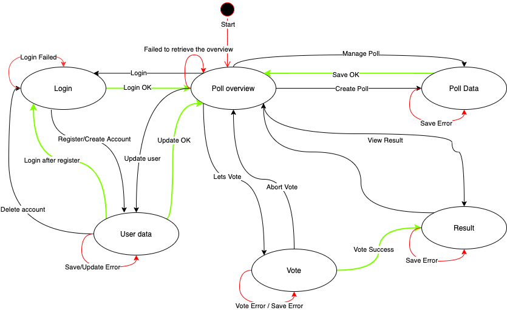

# FeedApp - Design Document

#### Gruppe 9

Andre Frøseth Jønland, Jan-Erik Erstad,  Kenneth Fossen, Rune Almåsbakk 

  

## FeedApp

The FeedApp is an application designed to allow to you vote on binary topics either through app / webpage or a configured IoT device connected to a poll.

The user can vote either anonymously or register an account.
Only registerd accounts can create polls for people to participate in.
The polls are only open in a certain timeframe, e.g they all have a start time and closing time for when the polls are active.

The polls can be configured to be avaible for anonymous (PUBLIC), open to registered users (REGISTERED) or private (PRIVATE) only shareable with a poll identifyer.

## Use case diagrams

In this compressed use case diagram the following roles are described.
A anonymous user, a register user, and an administrative user for the system.

The anonymous user is able to participate in a selected subset of the polls.
Only polls that are _public_ are for the anoymous user.
Registed users have access to all the polls tha show up in their overview, they can also participate in _secret_ polls shared with an identifier.

Administrative users have the access to clean up useraccounts / polls and configure IoT devices to be connected to the system.

  

## The domain model for the application

FeedUser is the table for all the users of the system.
The users are identified by their email address and it has to be unique for all the users. They are also given a role that is an enum consisting of the following 3 choises ADMIN, ANONYMOUS, USER.

Each user can create a poll and they will be the owner of it.
Each poll will get their own unique id to be identified with.
The poll have 6 configurable options.
The access, what users will have access to the poll.
Timespan (timestart timeend) for when the poll is valid.
Name of the poll, and the question they would like to have answered.
There is an optional configuration for the answers yes and no,
and if they are not configured they will default to yes or no.

The the voters are voting a FeedVote object is create for each vote so the users cannot vote more than once.
All of this is linked to the FeedPollResult that is related to a FeedPoll.
In this we store some information about the result.
The list of feedvotes will be able to visualise the voting process over its timespan.

## Application flow diagrams (Front End)

All users to start at the overview page.
There anonymous users have the choice to create an account and login or just vote in public polls.

The overview will produce a screen with only public polls, and when logged in, a public list and your own polls.
From this overview you will be able to see the result of the polls.

In the User data screen you will be able to register your details.
Also be able to cancel your account or edit your data after you have created an account in the system. Everytime you change or alter your data the data will be validated.

Voting screen only allows you to view the vote for a poll,
and then decide to vote or not. If you vote, you will be taken to the result view to follow the voting process. If you vote, the user and its vote will be registered, if this fails, you will not leave the voting page. When the data is validated you will end up on the result page.

Creating polls is done in the Poll Data Screen,
you will be able to edit the poll.

Basic state machine for the front-end

  

Different view to the flow of the app

## Mock-up user screens

A series of mock-ups for our intende app.

The mockups are showing a user landing on the overview page, logging in to the system and creating a poll and voting on it. He also changes his user information and leaves the webpage. The register screen is show for comparison, but the route the user would take to a register screen is overview -> login -> registersscreen.

## An architectural diagram

Level 3 IoT Diagram

FeedApp is desinged as a cloud service, it main user interaction is through its webapplication.
This FeedApp is divided into prestentaion layer, the buisness logic and the database layer.

The REST API handles the businesslayer for the FeedApp presentation layer and communicates with the database.

It also is the communication layer between IoT devices that are configured to use the system.

In the FeedApp we are able to export results to dweet.io as the architectual diagram shows under.

