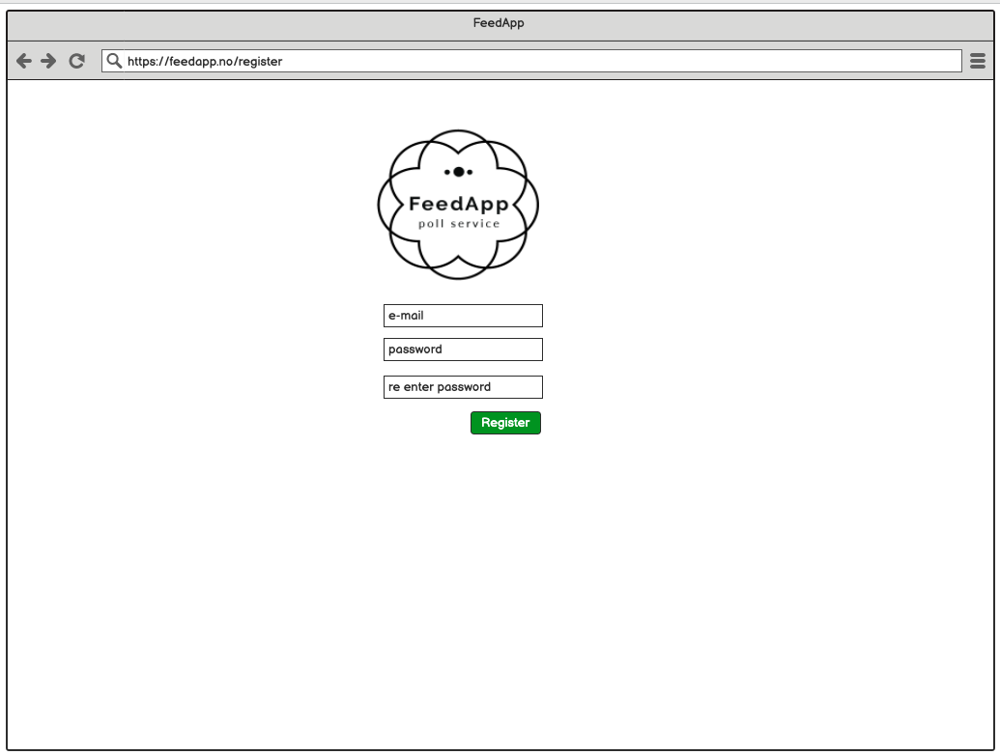
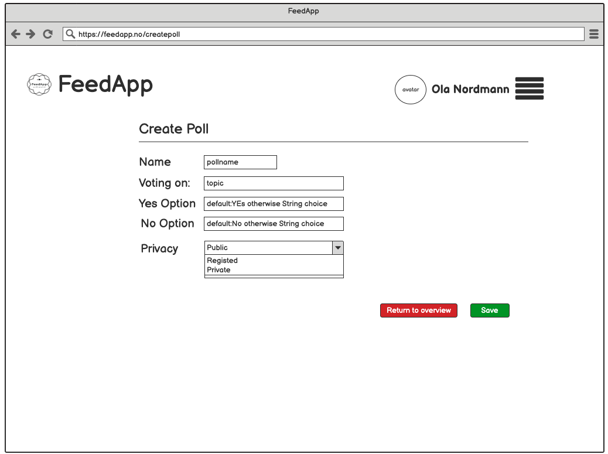
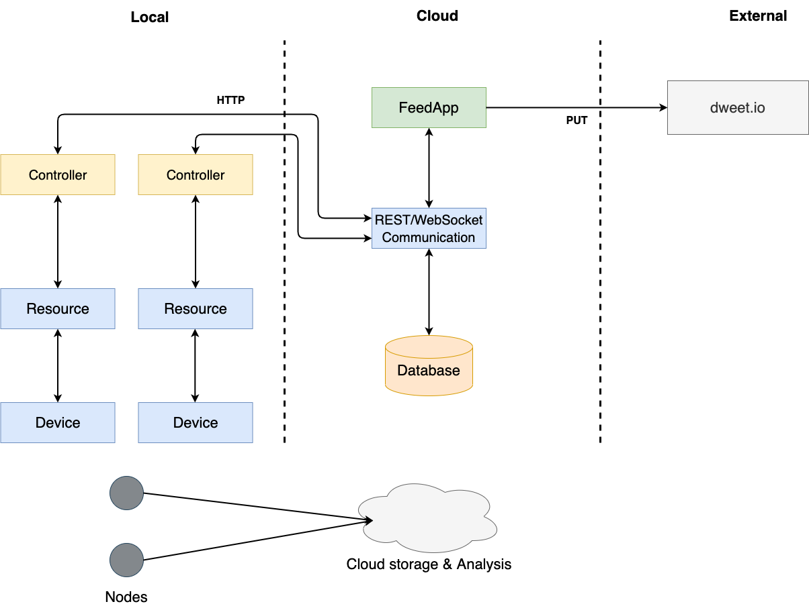

# FeedApp - Design Document

#### Gruppe 9

Andre Frøseth Jønland, Jan-Erik Erstad,  Kenneth Fossen, Rune Almåsbakk 

  

## The domain model for the application

## Use case diagrams

## Application flow diagrams (Front End)

Basic state machine for the front-end

Different view to the flow of the app

## Mock-up user screens

A series of mock-ups for our intende app

## An architectural diagram

Level 4 Diagram

