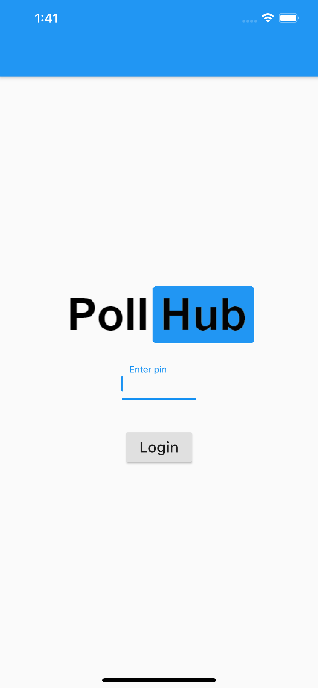
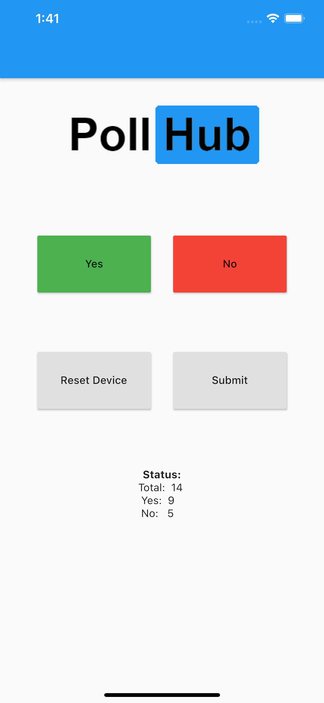
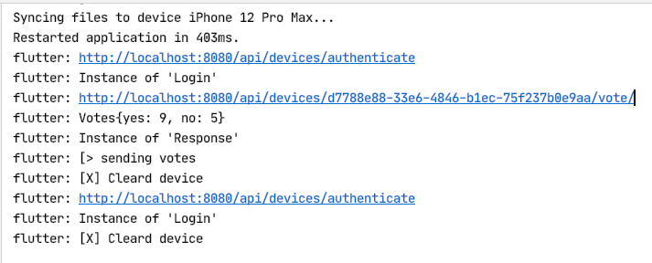

# IoT device in action

Built in Flutter.
Makes the app portable to many devices
(iOS, Android, Web, macOS, Windows App, Linux App)

To build for iOS you have to have a Apple Product.
Same goes for macOS (the build has to happen there)
Same goes for Windows App and Linux App.
You have to build on its repective plattform.

## Screenshots of IoT

## Device in action

[Demo video from app](device/iot-device.mov)