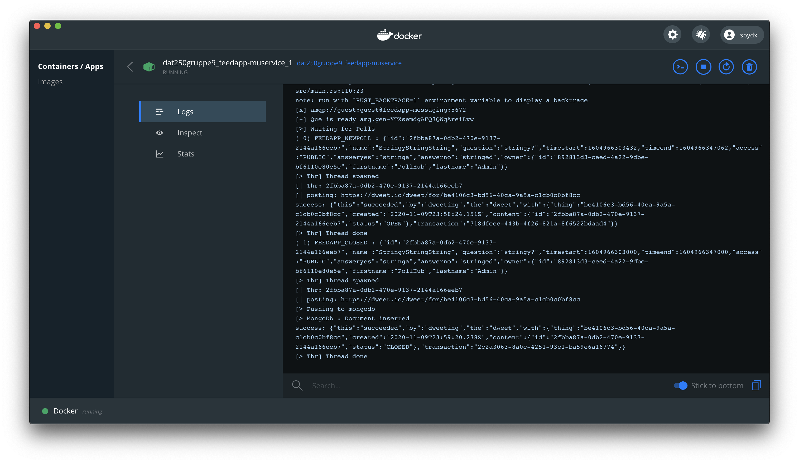

# MuService in action

microService that subscribes to messages from FeedApp API.

The service is build using [Rust](www.rust-lang.org)
Fast and good language to build services in.

the subcription is looping forever waiting for messages, 
It passes async jobs to new threads to post data onto Dweetio.
Result data is dumped in a _cloud mongodb_ database.
We are simulating this connection in this project.

The FeedApp API pushes these selfexplanatory messages:

* FEEDAPP_NEWPOLL
* FEEDAPP_CLOSED
* FEEDAPP_RESULT

## DweetIO

`FEEDAPP_NEWPOLL` and `FEEDAPP_CLOSED` are messages that are being pushed to
[Dweetio](https://dweet.io)

The opening and closing is pushed as events to this system.
The `secret` identifier for our thing is: `be4106c3-bd56-40ca-9a5a-c1cb0c0bf8cc`.

All events can be listened to on this address:

[https://dweet.io/dweet/for/be4106c3-bd56-40ca-9a5a-c1cb0c0bf8cc](https://dweet.io/dweet/for/be4106c3-bd56-40ca-9a5a-c1cb0c0bf8cc)

## Cloud MongoDb NoSQL database

All messages comming in with `FEEDAPP_RESULT` will be parsed,
and pushed to to mongodb cloud.
It the messages doesn't fit the `struct PollResult` it will fail silently in the service.

Since we are simulating a mongodb cloud, we are storing the result for further analysis in a "local" database, the content is sent throug messages from the API => RabbitMQ => MuService => Cloud MongoDb.

Every document is stored in `resultcol` in the `feedapp` database,
that the user `feedapp` has access to.

## Console Log Example

This is an example with some verbose logging on the muService.

